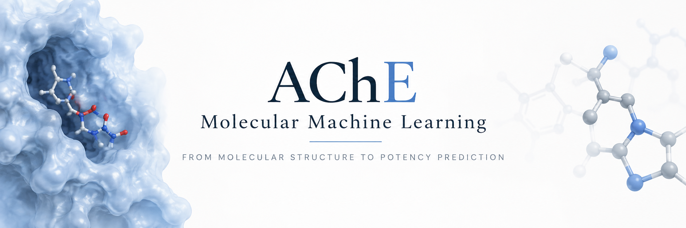
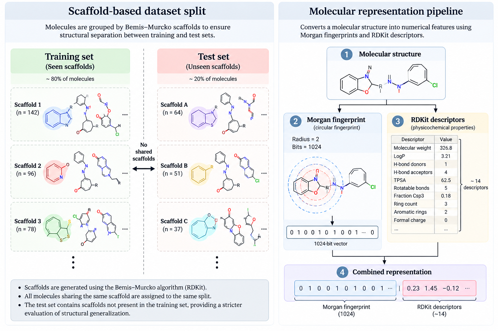
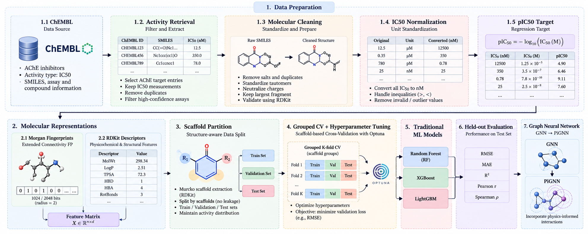

<div align="center">

### **ஓம் சரவணபவ**

</div>


<div align="center">
      
</div>

<div align="center">

## 🧬 AChE Molecular Machine Learning

### Structure-aware prediction of acetylcholinesterase inhibitory potency


<br>


[](https://doi.org/10.5281/zenodo.23182018)
<br><br>


</div>

---

## 📑 Contents

- [🔬 Project Overview](#-project-overview)
- [🎯 Objective](#-objective)
- [🧪 Dataset](#-dataset)
- [🧹 Data Preparation](#-data-preparation)
- [🧬 Molecular Representations](#-molecular-representations)
- [🧩 Scaffold-Aware Partitioning](#-scaffold-aware-partitioning)
- [🤖 Classical Machine Learning](#-classical-machine-learning)
- [⚙️ Hyperparameter Optimization](#️-hyperparameter-optimization)
- [📏 Evaluation](#-evaluation)
- [📊 Experimental Design](#-experimental-design)
- [🧠 Graph Neural Network](#-Graph-Neural-Network)
- [📈 Architecture](#-Architecture)
- [🛠️ Technology Stack](#️-technology-stack)
- [🚧 Current Status](#-current-status)
- [🔭 Future Direction](#-future-direction)
- [📚 Technical Documentation](#-technical-documentation)
- [📖 Citation](#-citations)
- [👤 Author](#-author)

---

## 🔬 Project Overview

This project develops a **structure-aware molecular machine-learning pipeline** for predicting the inhibitory potency of compounds against **acetylcholinesterase (AChE)**.

The current implementation establishes a classical QSAR/ML benchmark using:

- ChEMBL bioactivity data
- Molecular standardization and quality control
- IC50 normalization and pIC50 transformation
- Morgan circular fingerprints
- RDKit molecular descriptors
- Scaffold-based molecular partitioning
- Grouped cross-validation
- Random Forest
- XGBoost
- LightGBM
- Optuna hyperparameter optimization
- Multi-metric evaluation and residual analysis

The project is subsequently already extended to engineering molecular representations toward **Graph Neural Networks (GNNs)**..

> **Research direction:** move from fixed molecular feature representations toward increasingly structure-aware and scientifically constrained molecular learning.

---

## 🎯 Objective

### Primary Task

Predict continuous **pIC50** values from molecular structure.

$$
pIC_{50} = -\log_{10}(IC_{50}[M])
$$

The learning problem is formulated as:

```text
Molecular Structure
        ↓
Molecular Representation
        ↓
Machine Learning Model
        ↓
Predicted pIC50
```

### Core Questions

| Question | Purpose |
|---|---|
| How informative are circular molecular fingerprints? | Evaluate local structural representation |
| What additional information do molecular descriptors provide? | Evaluate physicochemical representation |
| Does combining both representations improve prediction? | Compare complementary feature spaces |
| How does structural separation affect performance? | Test molecular generalization |
| How do classical models compare under the same representation? | Establish reliable baselines |
| Can graph representations improve molecular learning? | GNN extension |


---

## 🧪 Dataset

| Property | Configuration |
|---|---|
| Data source | ChEMBL |
| Target | Acetylcholinesterase |
| ChEMBL Target ID | `CHEMBL220` |
| Activity endpoint | `IC50` |
| Learning target | `pIC50` |
| Task | Continuous regression |

Activity records are retrieved for the AChE target with available IC50 measurements.

Raw activity data are processed before being passed to the learning algorithms.

---

## 🧹 Data Preparation

The preprocessing pipeline converts raw bioactivity records into a consistent molecular-level regression dataset.

### Processing flow

```text
ChEMBL Activity Records
          ↓
Data Validation
          ↓
Salt Removal
          ↓
Molecular Identity / InChIKey
          ↓
Duplicate Handling
          ↓
IC50 Unit Normalization
          ↓
pIC50 Transformation
          ↓
Replicate Aggregation
          ↓
Activity Filtering
          ↓
Final Molecular Dataset
```

### Molecular cleaning

The current pipeline performs:

- SMILES validation
- salt removal
- canonical molecular representation
- InChIKey generation
- duplicate handling
- activity-value validation

### IC50 normalization

Supported source representations are normalized to a common concentration representation before pIC50 calculation.

$$
pIC_{50}=-\log_{10}(IC_{50}[M])
$$

### Replicate measurements

Multiple measurements corresponding to the same molecular identity are grouped using `InChIKey`.

The current implementation calculates the median pIC50 and uses group-level median absolute deviation as a quality-control criterion.

This step is treated as part of the **dataset definition**, rather than as a modeling operation.

---

## 🧬 Molecular Representations

Two complementary engineered representations form the current classical ML feature space.

### 1. Morgan Fingerprints

| Parameter | Value |
|---|---:|
| Representation | Morgan circular fingerprint |
| Radius | `2` |
| Fingerprint size | `1024 bits` |

```text
Molecular Structure
       ↓
Circular Atom Environments
       ↓
Morgan Fingerprint
       ↓
1024-bit Vector
```

### 2. RDKit Molecular Descriptors

The current descriptor representation captures molecular physicochemical and structural properties including:

- Molecular weight
- MolLogP
- H-bond donors
- H-bond acceptors
- TPSA
- Partial-charge descriptors
- Heteroatom count
- Rotatable bonds
- Fraction Csp3
- Aromatic ring count
- Ring count
- Aliphatic nitrogen count
- Formal charge

### Feature configurations

| Configuration | Input |
|---|---|
| Morgan | 1024-bit Morgan fingerprint |
| RDKit | Molecular descriptors |
| Combined | Morgan + RDKit descriptors |

---

## 🧩 Scaffold-Aware Partitioning

A central component of the project is **structure-aware evaluation**.

Random molecular splits can distribute closely related compounds between training and test sets. This can make a model appear to generalize when it is benefiting from structurally similar compounds during training.

The pipeline therefore groups molecules according to their **Bemis–Murcko scaffold** and assigns scaffold groups to dataset partitions.

```text
Molecules
    ↓
Murcko Scaffold
    ↓
Scaffold Groups
    ↓
Training / Test Partition
```

> Molecules sharing a scaffold are kept within the same partition.

<div align="center">



</div>

---

## 🤖 Classical Machine Learning

The current benchmark consists of three tree-based ensemble models.

| Model | Role |
|---|---|
| **Random Forest** | Non-parametric ensemble baseline |
| **XGBoost** | Gradient-boosted tree model |
| **LightGBM** | Gradient-boosted tree model |

Each model is evaluated across the same molecular representation configurations:

```text
                 Morgan     RDKit     Combined
                    │          │          │
Random Forest       ✓          ✓          ✓
XGBoost             ✓          ✓          ✓
LightGBM            ✓          ✓          ✓
```

This provides a controlled comparison between **model family** and **molecular representation**.

---

## ⚙️ Hyperparameter Optimization

Hyperparameter selection is performed using **Optuna**.

```text
Training Data
      ↓
Scaffold-Grouped Cross-Validation
      ↓
Model Evaluation
      ↓
Validation MAE
      ↓
Optuna Trials
      ↓
Best Hyperparameters
      ↓
Final Training
```

The current implementation uses **3-fold GroupKFold**, with scaffold identity used as the grouping variable.

The optimization objective is based on mean absolute error.

---

## 📏 Evaluation

| Metric | Interpretation |
|---|---|
| **MAE** | Mean absolute prediction error |
| **RMSE** | Error with stronger penalty for large deviations |
| **R²** | Variance explained relative to the target mean |
| **Pearson r** | Linear association |
| **Spearman ρ** | Rank-order association |

Residuals are calculated as:

$$
e_i = y_i - \hat{y}_i
$$

This enables analysis of:

- systematic prediction bias
- high-error compounds
- activity-range dependence
- residual distributions
- prediction calibration
- model failure regions

---

## 📊 Experimental Design

### Representation comparison

```text
Morgan
   │
   ├── Random Forest
   ├── XGBoost
   └── LightGBM

RDKit Descriptors
   │
   ├── Random Forest
   ├── XGBoost
   └── LightGBM

Morgan + RDKit
   │
   ├── Random Forest
   ├── XGBoost
   └── LightGBM
```

### Validation hierarchy

```text
                Full Dataset
                     │
                     ▼
          Scaffold-Based Split
              ┌──────┴──────┐
              ▼             ▼
           Training        Test
              │
              ▼
       Grouped 3-Fold CV
              │
              ▼
       Optuna Optimization
              │
              ▼
       Final Model Training
              │
              ▼
        Held-Out Evaluation
```

The held-out test partition is reserved for final evaluation rather than hyperparameter selection.

---


## 🧠 Graph Neural Network

The classical models represent molecules using fixed engineered features such as
Morgan fingerprints and RDKit descriptors. The GNN stage instead represents each
molecule explicitly as a **chemical graph**, allowing the model to learn
structure-dependent representations through message passing.

The GNN was evaluated as a separate model family under the same
**scaffold-held-out test partition** used for the audited classical comparison.

### Molecular Graph

Each molecule is represented as:

$$
G=(V,E)
$$

where:

- $V$ represents atoms
- $E$ represents chemical bonds

The graph contains **7 atom-level feature channels** and **13 bond-level feature
channels**.

### Node Features

Each atom is represented using:

| Feature | Description |
|---|---|
| Atomic number | Element identity |
| Degree | Number of directly connected atoms |
| Formal charge | Charge state |
| Hybridization | Hybridization state |
| Aromaticity | Aromatic atom indicator |
| Hydrogen count | Number of attached hydrogens |
| Ring membership | Whether the atom belongs to a ring |

### Edge Features

Bond representations contain **13 channels**, including:

- single, double, triple, and aromatic bond types
- conjugation
- aromaticity
- ring membership
- stereochemical configuration

Each molecular bond is represented in both directions for message passing.

---

### Message Passing

The graph network projects the categorical node and edge representations into a
shared hidden representation and performs **three message-passing steps**.

Conceptually:

```text
Atom Features + Bond Features
             ↓
      Feature Projection
             ↓
      Message Passing × 3
             ↓
       GRU-based Updates
             ↓
     Residual + Normalization
             ↓
       Graph Representation
```

## 📈 Architecture

<div align="center">



</div>


---

## 🛠️ Technology Stack

| Category | Technologies |
|---|---|
| Language | Python |
| Bioactivity | ChEMBL |
| Cheminformatics | RDKit |
| Data | NumPy · Pandas · DuckDB |
| Classical ML | scikit-learn · XGBoost · LightGBM |
| Optimization | Optuna |
| Statistics | SciPy |
| Visualization | Matplotlib · Seaborn |
| Experiment Tracking | MLflow |
| Graph ML  | PyTorch · PyTorch Geometric |

---

## 🚧 Current Status

| Component | Status |
|---|:---:|
| ChEMBL data retrieval | ✅ |
| AChE / CHEMBL220 dataset | ✅ |
| Molecular cleaning | ✅ |
| IC50 normalization | ✅ |
| pIC50 transformation | ✅ |
| Replicate handling | ✅ |
| Morgan fingerprints | ✅ |
| RDKit descriptors | ✅ |
| Scaffold grouping | ✅ |
| Scaffold-aware split | ✅ |
| Random Forest | ✅ |
| XGBoost | ✅ |
| LightGBM | ✅ |
| Optuna optimization | ✅ |
| Grouped CV | ✅ |
| Multi-metric evaluation | ✅ |
| Residual analysis | ✅ |
| Dataset / validation audit |  ✅ |
| GNN |  ✅ |
---

## 🔭 Future Direction

The project progresses through increasingly structured molecular representations:

```text
Engineered Features
        ↓
Classical Molecular ML
        ↓
Molecular Graphs
        ↓
Graph Neural Networks
        ↓
Physics-Informed GNNs
        ↓
Structure-aware Molecular Machine Learning
```

The longer-term direction is to connect:

**molecular structure → biological activity → mechanistic understanding**

rather than optimizing predictive performance in isolation.

---

## 📚 Technical Documentation

A separate technical report contains the detailed methodology, data-processing decisions, feature definitions, model configurations, hyperparameter spaces, validation analysis, GNN methodology, and experimental results.

The complete research record and archived software release are preserved through Zenodo.

---

## 📖 Citation

If you use this repository, its methodology, implementation, or derived results in academic or scientific work, please cite the archived software release:

**Venkataramanan, D. (2026).**  
*AChE Molecular Machine Learning: Structure-Aware Prediction of Acetylcholinesterase Inhibitory Potency.*  
Zenodo.  
https://doi.org/10.5281/zenodo.23182018

### BibTeX

```bibtex
@software{venkataramanan_ache_qsar_2026,
  author       = {Venkataramanan, Darshan},
  title        = {AChE Molecular Machine Learning: Structure-Aware Prediction of Acetylcholinesterase Inhibitory Potency},
  year         = {2026},
  version      = {1.0.0},
  publisher    = {Zenodo},
  doi          = {10.5281/zenodo.23182018},
  url          = {https://doi.org/10.5281/zenodo.23182018}
}

```

---


## 👤 Author

<div align="center">

### **தர்ஷன் வெங்கட்டரமணன்**

**கணக்கீட்டு உயிரியல் • வேதியியல் தகவல் புள்ளியியல் • மூலக்கூறு இயந்திரக் கற்றல் • கணக்கீட்டு மருந்து கண்டுபிடிப்பு**

a.k.a 

### **Darshan Venkataramanan**

**Computational Biology · Cheminformatics · Molecular Machine Learning · Computational Drug Discovery**

<br>

*Building from molecular representations toward scientifically grounded learning.*

</div>

---

